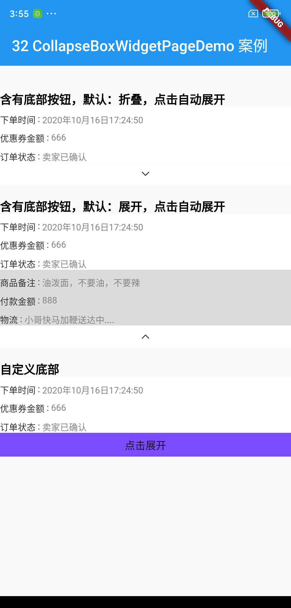

[](https://pub.dartlang.org/packages/collapsebox)

# collapsebox

[`collapsebox`](https://pub.dartlang.org/packages/collapsebox) 用来管理展开子组件的``widget``.

掘金博客 : https://juejin.cn/post/6907122316715491335/

## 使用方法

pubspec.yaml

```
dependencies:
  flutter:
    sdk: flutter
  flutter_localizations:
    sdk: flutter
  ...
    
  collapsebox: ^1.0.0
```

collapsebox 基础用法:

```dart
Widget buildColumnStretchedBoxWidget() {
  return ColumnCollapseBoxWidget(
    bottomArrowImageRes: 'images/image_down_expand.png',// 箭头图片资源
    bottomBarColor: Colors.white,// 箭头图片所在空间背景颜色
//      collapseboxState: CollapseBoxState.normal,// normal 默认模式
    alwaysShowChild: Container(// 总是显示的区域
      color: Colors.white,
      child: Column(
        children: normalList,
      ),
    ),
    collapsedChild: Container(// 展开时才会展示的区域
      color: Colors.black12,
      child: Column(
        children: [...expandList],
      ),
    ),
  );
}
```

collapsebox 自定义底部控件的用法:

```dart
Widget buildColumnCollapseBoxWidget() {
  return ColumnCollapseBoxWidget(
    ...
    bottomBarWidget: (context, collapseboxViewModel) {// 底部控件自定义配置
      Widget text;
      if (collapseboxViewModel?.isExpand() ?? false) {
        text = Text("点击折叠");
      } else {
        text = Text("点击展开");
      }

      return GestureDetector(
        behavior: HitTestBehavior.opaque,
        onTap: () {
          collapseboxViewModel?.switchCollapseBoxMode();
        },
        child: Container(
          height: 32,
          width: double.infinity,
          color: Colors.deepPurpleAccent,
          child: Center(
            child: text,
          ),
        ),
      );
    },
  );
}
```

允许自定义设置底部控件.

## 运行截图:



查阅 [案例](https://github.com/HailouWang/AndroidGo/tree/master/flutter_demo/lib/widget/collapsebox).

## 实现思路

