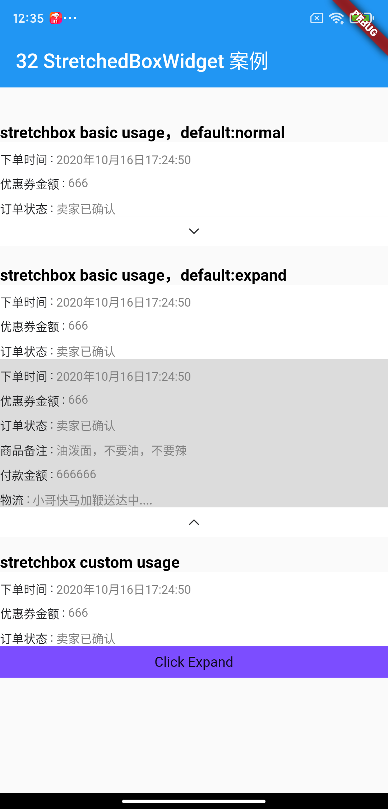
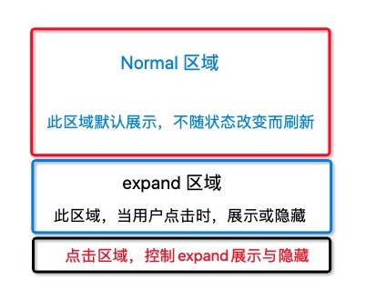

[](https://pub.dartlang.org/packages/collapsebox)

# collapsebox

An [`collapsebox`](https://pub.dartlang.org/packages/collapsebox) widget provides two modes of collapse and expand, using provider components to support widget state change when click.

Guild Link : https://juejin.cn/post/6907122316715491335/

## Usage

pubspec.yaml

```
dependencies:
  flutter:
    sdk: flutter
  flutter_localizations:
    sdk: flutter
  ...
    
  collapsebox: ^1.1.0
```

collapsebox Basic usage:

```dart
Widget buildColumnCollapseBoxWidget() {
  return ColumnCollapseBoxWidget(
    // arrow image resource
    bottomArrowImageRes: 'images/image_down_expand.png',
    // arrow image area bg color
    bottomBarColor: Colors.white,
//      stretchState: StretchedBoxState.normal,// normal default
    // area show always
    alwaysShowChild: Container(
      color: Colors.white,
      child: Column(
        children: [
          Text("Normal Area 1"),
          Text("Normal Area 2"),
          Text("Normal Area 3"),
        ],
      ),
    ),
    // area show by expand
    collapsedChild: Container(
      // 展开展示区域
      color: Colors.black12,
      child: Column(
        children: [
          Text("Collapse Area 1"),
          Text("Collapse Area 2"),
        ],
      ),
    ),
//      bottomBarWidget: _buildCustomBottomWidget,// bottom widget custom set
  );
}
```

collapsebox Custom usage:

```dart
Widget buildCustomStretchedBoxWidget() {
  return CollapseBoxWidget(
    alwaysShowChild: Container(
      color: Colors.white,
      child: Column(
        children: [
          Text("Normal Area 1"),
          Text("Normal Area 2"),
          Text("Normal Area 3"),
        ],
      ),
    ),
    collapsedChild: Container(
      color: Colors.black12,
      child: Column(
        children: [
          Text("Collapse Area 1"),
          Text("Collapse Area 2"),
        ],
      ),
    ),
    // custom bottomBar Widget set
    bottomBarWidget:
        (BuildContext context, CollapseboxBoxViewModel collapseboxViewModel) {
      Widget text;
      if (collapseboxViewModel?.isExpand() ?? false) {
        text = Text("Click Collapse");
      } else {
        text = Text("Click Expand");
      }

      return GestureDetector(
        behavior: HitTestBehavior.opaque,
        onTap: () {
          collapseboxViewModel?.switchCollapseBoxMode();
        },
        child: Container(
          height: 32,
          width: double.infinity,
          color: Colors.deepPurpleAccent,
          child: Center(
            child: text,
          ),
        ),
      );
    }, // 自定义底部Widget方式
  );
}
```

allow bottom widget custom set.

## screenshot:



see the [example](https://github.com/HailouWang/AndroidGo/tree/master/flutter_demo/lib/widget/collapsebox).


## idea

