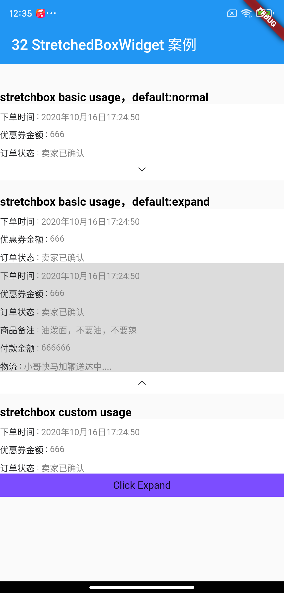
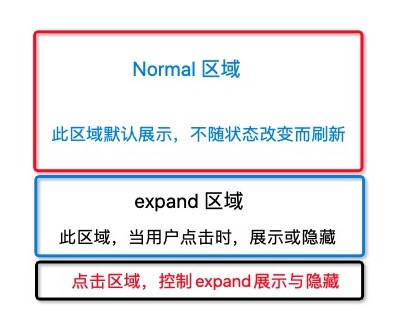

[](https://pub.dartlang.org/packages/stretchbox)

# stretchbox

An [`stretchbox`](https://pub.dartlang.org/packages/stretchbox) widget for expand sub widgets.

## Usage

stretchbox Basic usage:

```dart
Widget buildColumnStretchedBoxWidget() {
  return ColumnStretchedBoxWidget(
    arrowImageRes: 'images/image_down_expand.png',// arrow image resource
    arrowContainerColor: Colors.white,// arrow image area bg color
//      stretchState: StretchedBoxState.normal,// normal default
    normalChild: Container(// area show always
      color: Colors.white,
      child: Column(
        children: normalList,
      ),
    ),
    expandChild: Container(// area show by expand
      color: Colors.black12,
      child: Column(
        children: [...normalList, ...expandList],
      ),
    ),
  );
}
```

stretchbox Custom usage:

```dart
Widget buildColumnStretchedBoxWidget() {
  return ColumnStretchedBoxWidget(
    ...
    bottomBarWidget: _buildCustomBottomWidget,// bottom widget custom set
  );
}
```

allow bottom widget custom set.

```dart
Widget _buildCustomBottomWidget(
    BuildContext context, StretchedBoxViewModel stretchedBoxViewModel) {
  Widget text;
  if (stretchedBoxViewModel?.isExpand() ?? false) {
      text = Text("Click Collapse");
  } else {
      text = Text("Click Expand");
  }

  return GestureDetector(
    behavior: HitTestBehavior.opaque,
    onTap: () {
      stretchedBoxViewModel?.switchStretchMode();
    },
    child: Container(
      height: 32,
      width: double.infinity,
      color: Colors.deepPurpleAccent,
      child: Center(
        child: text,
      ),
    ),
  );
}
```

## screenshot:



see the [example](https://github.com/HailouWang/AndroidGo/tree/master/flutter_demo/lib/widget/stretchbox).


## idea

